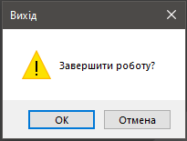
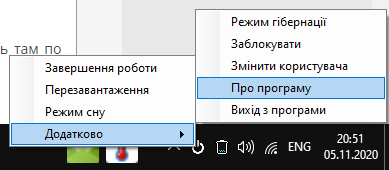

MiniShutdownUA
==============

MiniShutdown - іконка завершення роботи для області сповіщень на панелі завдань.

--------------------------------------------------------------------------------

Подвійний клік по іконці програми викликає діалогове вікно завершення роботи системи.

--------------------------------------------------------------------------------

Клік правою кнопкою миші по іконці програми викликає її меню.

--------------------------------------------------------------------------------

Завантажити [setupShutdown.exe](https://github.com/AndriiVal/MiniShutdownUA/releases)